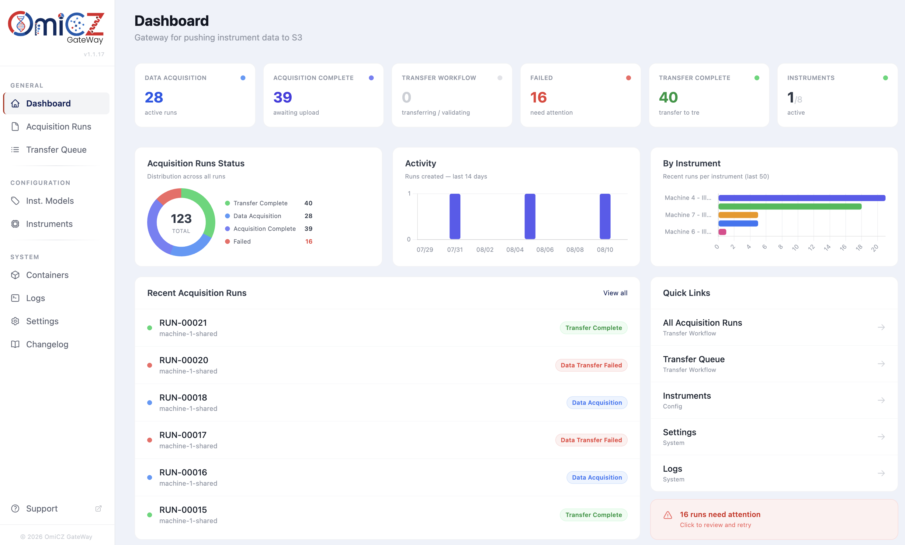
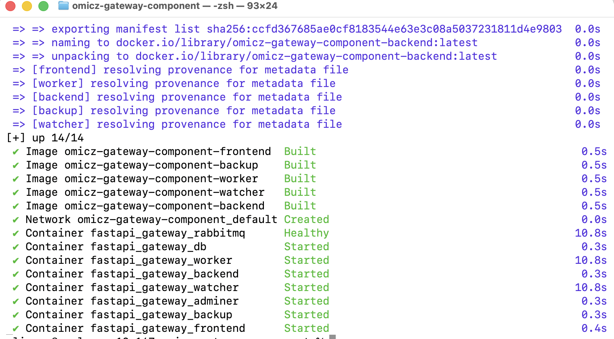
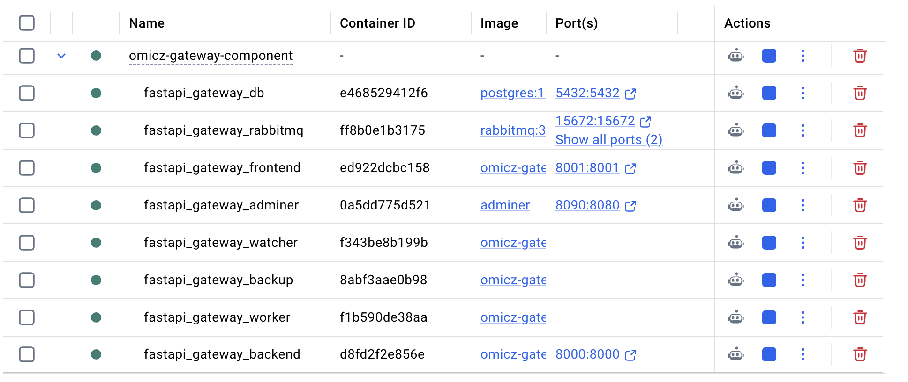
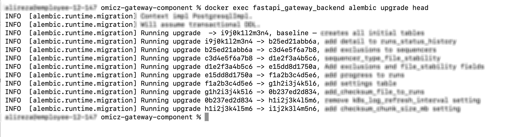

# OmiCZ Gateway

A web application for managing DNA sequencer runs. It monitors sequencer output folders on your computer, detects when runs complete, generates checksums, and uploads run data to S3 storage automatically.



---

## What it does

- Watches configured sequencer machine output folders for new run folders
- Detects run completion via a **signal file** (e.g. `RTAComplete.txt`) or **file stability** (files stop growing)
- Generates a SHA256 checksum file for the run
- Uploads the run folder to S3
- Provides a web UI to manage sequencers, runs, and monitor upload status in real time

---

## Requirements

- [Docker Desktop](https://docs.docker.com/get-docker/) installed and running / [Rancher Desktop](https://rancherdesktop.io/) installed and running with dockerd container engine
- S3 storage credentials (endpoint URL, access key, secret key) — get these from the project administrator

---

## How it works (overview)

The app runs as a set of Docker containers on your computer. It needs to know where your sequencer machine saves its output folders. You tell it this by setting a path in a `.env` file. Docker then makes that folder visible to the app containers, and the app watches it for new runs.

```
Your computer's folder  →  Docker volume mount  →  App sees it as /runs/machine-1
e.g. /data/illumina          (docker-compose.yml)
```

---

## Installation

Follow these steps in order. Each step explains what you are doing and why.

---

### Step 1 — Clone the repository

Download the project code to your computer:

```bash
git clone https://github.com/BioIT-CEITEC/omicz-gateway-component.git
cd omicz-gateway-component
```

---

### Step 2 — Create your `.env` file

The `.env` file tells Docker where your sequencer output folders are on **your** computer.

Linux / MacOS:
```bash
cp .env.example .env
```
Windows (Command Prompt):
```cmd
copy .env.example .env
```

Open `.env` and replace the example paths with real paths on your machine:


**Linux / MacOS paths:**
```env
# The real path to your sequencer output folder on this computer:
MACHINE_1_PATH=/data/sequencers/machine-1
MACHINE_1_PATH_SHARED=/data/sequencers/machine-1-shared
```

**Windows paths:**
```env
MACHINE_1_PATH=C:\Sequencer\Machine1
MACHINE_1_PATH_SHARED=C:\Sequencer\Machine1Shared
```

**Why these variable names?**
The `docker-compose.yml` already has volume lines that reference `${MACHINE_1_PATH}` and `${MACHINE_1_PATH_SHARED}`. Docker reads your `.env` file and substitutes those values automatically. The names must match exactly.

**If you are adding a new machine** that is not already in `docker-compose.yml`, you also need to add a volume line for it in the `backend`, `worker`, and `watcher` services. Open `docker-compose.yml` and add one line per machine under the volumes section of each of those three services:

```yaml
volumes:
  - ./backend:/app
  - ${MACHINE_1_PATH}:/runs/machine-1          # already there
  - ${MACHINE_1_PATH_SHARED}:/runs/machine-1-shared   # already there
```

The right side (`/runs/machine-2`) is the path **inside the container** — this is what you will enter in the **Location** field when creating the sequencer in the UI.


---

### Step 3 — Create the backend `.env` file

The backend needs its own configuration file for S3 credentials and database settings.

Linux / MacOS:
```bash
cp backend/.env.example backend/.env
```
Windows (Command Prompt):
```cmd
copy backend/.env.example backend/.env
```

Open `backend/.env` and fill in your S3 credentials:

```env
S3_ENDPOINT=https://your-s3-proxy-url
S3_ACCESS_KEY=your_access_key
S3_SECRET_KEY=your_secret_key
S3_BUCKET=your-bucket-name
S3_PREFIX=raw_run_data/
```

The database settings in this file can be left as-is — they match the database container defined in `docker-compose.yml`.

---

### Step 4 — Build and start the containers

This downloads the required images (PostgreSQL, RabbitMQ) and builds the application containers. It takes a few minutes the first time. Run below command in root of the project.

```bash
docker compose up -d --build
```

You should see output like this once it finishes:



What this starts:

| Container | Purpose |
|-----------|---------|
| `fastapi_gateway_db` | PostgreSQL database — stores sequencers, runs, history |
| `fastapi_gateway_rabbitmq` | Message queue — passes events between services |
| `fastapi_gateway_backend` | REST API — the brain of the application |
| `fastapi_gateway_frontend` | Web UI — what you see in the browser |
| `fastapi_gateway_worker` | Processes run events — does checksumming and S3 upload |
| `fastapi_gateway_watcher` | Watches the sequencer folders for new runs |
| `fastapi_gateway_backup` | Backup service for the application |
| `fastapi_gateway_adminer` | GUI for PostgreSQL |


To check that all containers are running:

```bash
docker ps
```

All 8 containers should show `Up`. You can also check in Docker Desktop:



---

### Step 5 — Run database migrations

This creates all the database tables. Only needed the first time (or after an update that includes schema changes).

```bash
docker exec fastapi_gateway_backend alembic upgrade head
```

You should see output like:
```
INFO  [alembic.runtime.migration] Running upgrade ...
```



---

### Step 6 — Open the web UI

| Service | URL | Login |
|---------|-----|-------|
| **Frontend (main UI)** | http://localhost:8001 | — |
| Backend API docs | http://localhost:8000/docs | — |
| RabbitMQ management | http://localhost:15672 | guest / guest |
| Adminer (database UI) | http://localhost:8090 | see below |

**Adminer login:**
- System: `PostgreSQL`
- Server: `db`
- Username: `postgres`
- Password: `postgres`
- Database: `fastapi_gateway_db`

---

## First-time configuration in the UI

After the app is running, you need to configure it through the web interface before it can watch any sequencer runs.

---

### Step A — Create an Inst. Models

An **Instrument Models** defines the model/brand of machine and how it signals that a run is complete. You create one type per machine model (not per machine).

Go to **Inst. Models → Create** in the top navigation.

| Field | What to enter | Example |
|-------|--------------|---------|
| **Name** | A label for this machine model | `Illumina NovaSeq 6000` |
| **Completion Method** | How the machine signals it is done | see below |
| **Completion Signal** | The filename it creates when done *(signal method only)* | `RTAComplete.txt` |
| **Signal Match** | How to match the filename | `exact` |
| **Stability Files** | Files to watch for size changes *(file_stability method only)* | `RunParameters.xml` |
| **Stability Threshold** | Minutes of no change before declaring done *(file_stability only)* | `10` |

**Completion Method options:**

- `signal` — the machine creates a specific file (e.g. `RTAComplete.txt`) when a run is done. The app watches for that file to appear.
- `file_stability` — the app monitors specific files and waits until they stop growing (no size change for N minutes). Use this for machines that do not create a completion file.

---

### Step B — Create an Instrument

An **Instrument** represents a specific physical machine connected to this computer. You create one entry per machine.

Go to **Instruments → Create** in the top navigation.

| Field | What to enter | Example |
|-------|--------------|---------|
| **Name** | A label for this specific machine | `Machine 2 - Illumina` |
| **Location** | The path **inside the container** where this machine's folder is mounted | `/runs/machine-2` |
| **Type** | Select the sequencer type you created in Step A | |
| **Send to TRE** | When to upload to S3 | see below |
| **Exclusions** | Files or patterns to skip during upload *(optional)* | `*.png`, `Thumbnail_Images` |

**Location field explained:**
This is not a path on your computer — it is the path *inside the Docker container*. It always starts with `/runs/`. The mapping between your computer's folder and this path is defined in `docker-compose.yml`:

```yaml
- ${MACHINE_2_PATH}:/runs/machine-2
#   ^ your computer       ^ container path (put this in Location field)
```

**Send to TRE options:**

- `auto` — upload to S3 automatically as soon as a run is detected as complete
- `manual` — wait for you to click the "Send to TRE" button on the run detail page

> After saving the sequencer, the watcher detects it within 60 seconds — no restart needed.

---

## Run status reference

Once an instrument is configured, the app detects new runs automatically. You can monitor them under **Acquisition Runs** in the navigation.

```
Data Acquisition → Acquisition Complete → Integrity Check → Data Transfer → Transfer Validation → Transfer Complete
                                                            ↘ Data Transfer Failed              ↘ Transfer Validation Failed
```

| Status | What it means | What to do |
|--------|--------------|------------|
| `Data Acquisition` | New run folder detected, data acquisition in progress | Wait |
| `Acquisition Complete` | Machine finished; waiting to start upload | Click **Send to TRE** (if manual mode) |
| `Integrity Check` | Generating SHA256 checksum file for the run | Wait |
| `Queued` | Waiting after previous upload is finished | Wait |
| `Data Transfer` | Uploading the run folder to S3 | Wait |
| `Transfer Validation` | Waiting for the TRE system to confirm receipt | Wait |
| `Transfer Complete` | Run fully uploaded and confirmed | Done |
| `Data Transfer Failed` | Upload failed | Click **Retry Upload** |
| `Transfer Validation Failed` | TRE verification failed | Click **Retry Verification** |

---

## Adding a new machine later

If a new sequencer machine is connected to this computer:

1. **Add its path to `.env`:**
   ```env
   MACHINE_2_PATH=/data/sequencers/new-machine
   ```

2. **Add a volume line in `docker-compose.yml`** — in the `backend`, `worker`, and `watcher` services:
   ```yaml
   - ${MACHINE_2_PATH}:/runs/machine-2
   ```

3. **Restart the full stack** (needed for Docker to pick up the new volume):
   ```bash
   docker compose down && docker compose up -d
   ```

5. **Create a new Sequencer in the UI** with Location `/runs/machine-2`

---

## Troubleshooting

**Containers not starting:**
```bash
docker compose logs
```

**One service has errors:**
```bash
docker logs fastapi_gateway_backend
docker logs fastapi_gateway_worker
docker logs fastapi_gateway_watcher
```

**Run stuck / not progressing:**
Check the worker logs — the worker processes all upload events:
```bash
docker logs fastapi_gateway_worker --tail 50
```

---

## After code changes

| What changed | Command to apply it |
|---|---|
| Python code in `backend/` or `frontend/` | `docker restart fastapi_gateway_backend fastapi_gateway_frontend` |
| `worker.py` or `watcher.py` | `docker restart fastapi_gateway_worker fastapi_gateway_watcher` |
| Database schema (new migration) | `docker exec fastapi_gateway_backend alembic upgrade head` |
| `Dockerfile` or `requirements.txt` | `docker compose build <service> && docker compose up -d <service>` |
| Settings in the UI | No restart needed — applied at runtime |
